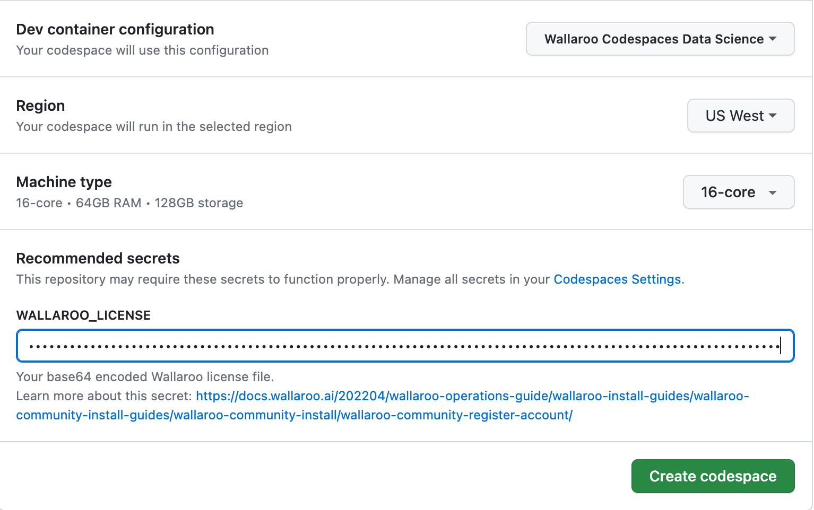
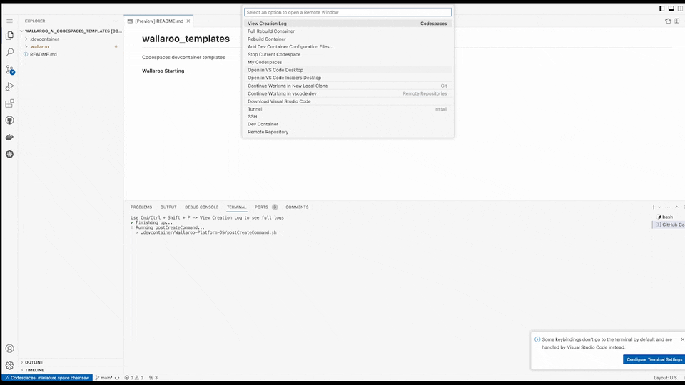
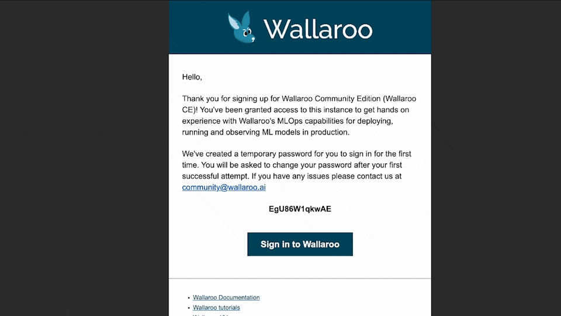
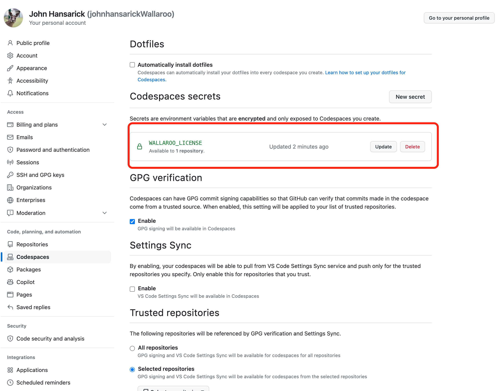

# wallaroo_templates
Codespaces devcontainer templates

<!--WALLAROO_START-->
<b>Wallaroo Starting</b>
<!--WALLAROO_END-->

The following details how to set up Wallaroo Community using [GitHub Codespaces](https://github.com/features/codespaces).  This provides a quick method of setting up Wallaroo Community with just a few commands.  You get the free license from [the Wallaroo Community Portal site](https://portal.wallaroo.community/), and the rest of the process is handled by GitHub and Wallaroo.

This is a feature complete version of Wallaroo Community with the following exceptions:

* Connections from the Wallaroo SDK to the Wallaroo Community instance are only available from the Wallaroo Community instance's JupyterHub service, launched from the Wallaroo Dashboard.

## Prerequisites

* **GitHub Account**:  [A GitHub account](https://github.com/).
* **GitHub Codespaces**:  See the [GitHub Codespaces Cost Calculator](https://github.com/pricing/calculator) for details on services costs.
* **Wallaroo Community License**:  Available for free from the [Wallaroo Community Portal page](https://portal.wallaroo.community/).

## Installation Steps

1. From the [Wallaroo Community Portal page](https://portal.wallaroo.community/), follow the registration instructions.  If a Wallaroo Community license already exists for this account, enter the same name and email address to retrieve the registration link.
1. Download the Wallaroo Community license.  This provides both the Wallaroo Community license in YAML format and the base64 encoded version.  Store both in a secure location.  The base64 ended version will be used in this process.
1. From the License Download page, select **GitHub Codespaces**.  Follow the link to the Wallaroo Community Codespaces installation template.
2. Set the following:

    

    1. **Dev container configuration**:  Set to **Wallaroo Codespaces Data Science**.
    2. **Region**:  Select the region where the codespace will run.  This should be the region geographically closest to the end user.
        1. Europe West
        2. Southeast Asia
        3. US West
        4. US East
    3. **Machine Type**:  Set the number of CPUs to use.  Leave as 16-cores - anything less the containers will not run.
    4. **Wallaroo Community License**:  Provide the base64 version of the Wallaroo license here.

3. When complete, select **Create Codespace**.  Wait until the process is complete - this usually takes about 15 minutes.

To see the installation process in action, use one of the following options:

* Enter either `Control-Shift-P` or `Command-Shift-P` (for MacOS systems) and select **Codespaces: View Creation Log**.
* Select from the lower left corner **Codespaces** and then **View Creation Log**.

Once the entry "Finished configuring codespace" is displayed, the Wallaroo Community installation is complete.

## Wallaroo Community First Login

If this is your first login, you will receive an email invitation for the email address connected to this URL with a temporary password.

To login to your new Wallaroo instance, enter the email address and temporary password associated with the license.  Enter a new password twice to set a new permanent password, and you will be logged into the Wallaroo Community instance.

Subsequent logins will are performed through the same URL.

## Stopping and Starting Wallaroo Community

To start and stop the Wallaroo Community codespace:

* **To stop the current Wallaroo Community codespace**: 
  * From the Wallaroo Community Codespace page, from the bottom left select **Codespaces**, then select the action **Stop Current Codespace**.
  * The other option is to press `F1` and select **Stop Current Codespace**.
* **To start a Wallaroo Community codespace**:  
  * Access your GitHub Codespaces page from GitHub by selecting your user profile icon in the upper right corner, then selecting **My Codespaces**.
  * From your GitHub Codespaces page, select your Wallaroo Community code space.
  * From the menu list on the right side, select **Open In...**, then **Open in Browser** to launch the Wallaroo Community Codespace page.  This will launch the Wallaroo Community containers and make them available once they are done starting up.

See [Setting your timeout period for GitHub Codespaces](https://docs.github.com/en/codespaces/customizing-your-codespace/setting-your-timeout-period-for-github-codespaces) for information on timeout settings.

## Additional GitHub Codespaces Options

### Update the Wallaroo Community License

When Wallaroo Community is installed through GitHub Codespaces, the base64 hash of the Wallaroo license used in the installation process is stored in GitHub.

To update this license:

1. Select your GitHub user profile, then **Settings**.
1. Select **Codespaces**, then **Codespaces secrets**.  The Wallaroo Community license is listed as **WALLAROO_LICENSE**.  Use **Update** to update the license or **Delete** to remove if it is no longer needed.

   
